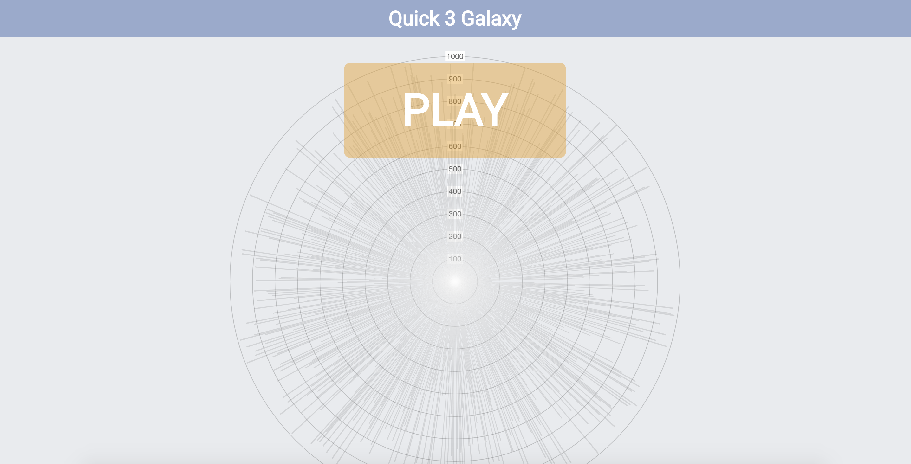

# Quick 3 Galaxy
### This was created during my time as a [Code Chrysalis](https://codechrysalis.io) Student




Quick 3 Galaxy is the visualization using Quick 3 Sort with some entertainments.

## Environment

### Installing dependencies

- node
- yarn

### Development

To install dependencies:

```bash
$ yarn
```

To run tests:

```bash
$ yarn test
```

If you take a look at the `package.json`, you'll notice that our command includes BOTH the linting as well as running mocha.

You can run them separately as well, but that's why we have the above command.

```bash
$ yarn lint
$ yarn test:mocha
```

We have a simple Express server (you can find the code in `app.js`) that is serving up our very basic `index.html` file. We are using webpack to compile all the code in our `src/` folder into one big file.

Go look inside `index.html` to find out what that one `.js` we have compiled all our code into is.

To start building a frontend codes:

```bash
$ yarn dev:client
```

To start a express web server:

```bash
$ yarn dev:server
```

Access `http://localhost:4000` in the browser.

### Production

To run in production:

```bash
$ yarn webpack
$ yarn start
```

If you want to deploy through Heroku will be as below:

- Create an app.
- Connect a GitHub repository.
- Deploy.

# Resources

- [Presentation](https://www.slideshare.net/DaenamKim/quick-3-galaxy)
- [Sorting Algorithms - Toptal](https://www.toptal.com/developers/sorting-algorithms)
- [Sorting Algorithms - Brilliant](https://brilliant.org/wiki/sorting-algorithms/)
- [Laser Sound](https://www.zapsplat.com/music/laser-noise-synth-burst-vintage/)
- [Ta Da Sound](http://soundbible.com/1003-Ta-Da.html)
- [Background Music(portion)](https://www.youtube.com/watch?v=SHY7vgiDT-Y)
- [Background Space GIF](https://giphy.com/gifs/while-starts-tL5HmgfZi0Qow)
